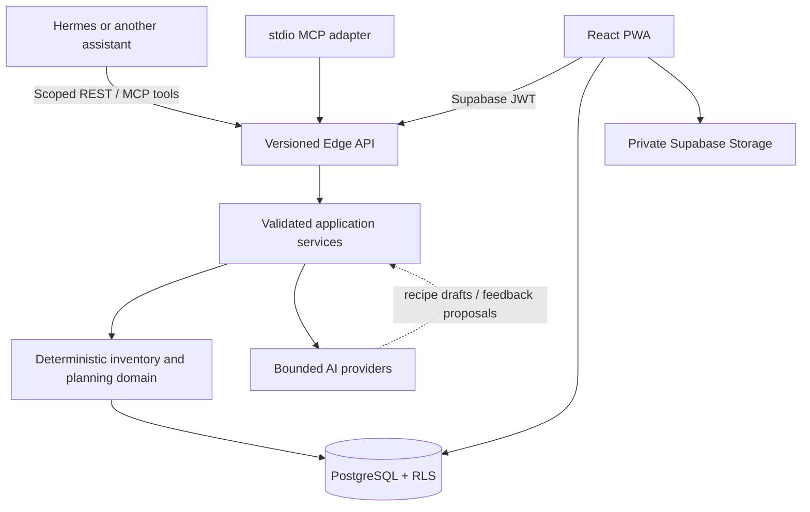

# Architecture

The database functions are authoritative for state-changing inventory operations. TypeScript domain functions provide matching previews, scoring, groceries, and tests. AI can propose content, but cannot reserve, consume, authorize, confirm, or mutate inventory directly.

Quantities and money are fixed-precision PostgreSQL numerics and decimal strings in contracts. Unit conversion is limited to explicit mass, volume, and same-unit families. A package conversion requires ingredient package metadata.

Inventory transactions are append-only. Planned meals reserve quantities; completion releases reservations and inserts consumption transactions atomically. Undo is represented by a compensating transaction referencing its source.
